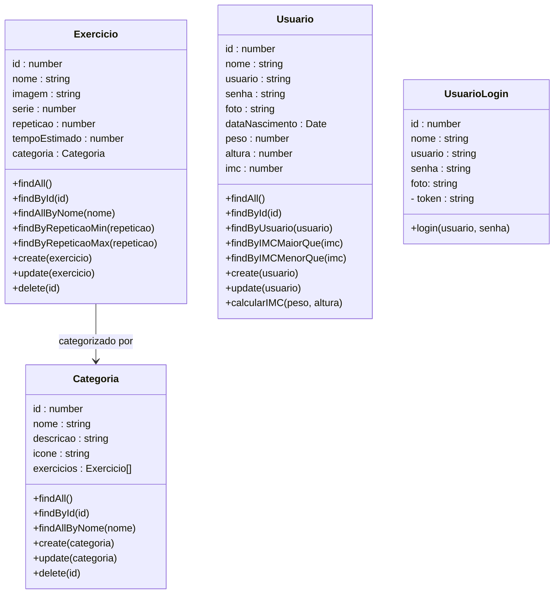
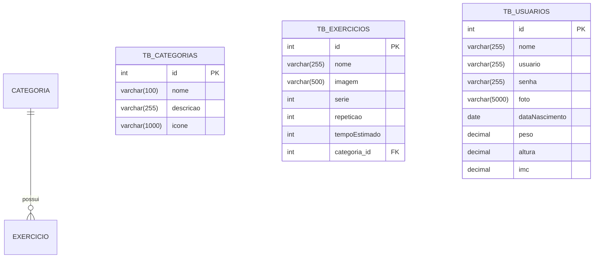

# Solara - API de Treinos Personalizados

<p align="center">
  <a href="http://nestjs.com/" target="blank"></a>
</p>

[circleci-image]: https://img.shields.io/circleci/build/github/nestjs/nest/master?token=abc123def456
[circleci-url]: https://circleci.com/gh/nestjs/nest


<div align="center">
      
  
  
  
  
  
  
</div>


## 1. Descrição

A Solara é uma plataforma de treinos personalizados desenvolvida pela Orbyte, inspirada na energia e constância das estrelas. O sistema cria rotinas de exercícios adaptadas ao perfil, objetivos e nível de cada usuário, guiando sua evolução física com precisão, consistência e foco. Assim como o Sol é o centro de um sistema, a Solara coloca o usuário no centro da sua própria jornada de saúde.

## 2. Sobre esta API

Esta API REST foi desenvolvida utilizando o framework NestJS com TypeScript, com integração a um banco de dados relacional hospedado na nuvem via Neon.

Ela é responsável por gerenciar os dados da aplicação de treinos personalizados Solara, permitindo o cadastro de usuários e a criação, consulta, atualização e remoção de treinos, exercícios e demais informações por meio de endpoints HTTP.

A API segue a arquitetura modular proposta pelo NestJS, organizando o código em controllers, services e módulos, garantindo maior organização, escalabilidade e facilidade de manutenção.

Para documentação e testes interativos dos endpoints, foi utilizada a ferramenta Swagger, permitindo uma visualização clara e acessível dos recursos disponíveis na API.

A aplicação foi implantada na plataforma de deploy Render, utilizando um banco de dados em nuvem fornecido pelo Neon, garantindo disponibilidade, escalabilidade e facilidade de acesso ao ambiente em produção.

### 2.1. Principais Funcionalidades

<b>1. Gerenciamento de Exercícios</b>
Permite criar, consultar, atualizar e remover exercícios físicos, possibilitando a organização e personalização dos treinos de acordo com diferentes objetivos e níveis de dificuldade.

<b>2. Gerenciamento de Usuários e Cálculo de IMC</b>
Possibilita o cadastro e a visualização de usuários, além do cálculo automático do Índice de Massa Corporal (IMC), fornecendo uma base para recomendações e acompanhamento da evolução física.

<b>3. Gerenciamento de Categorias</b>
Permite criar e administrar categorias de exercícios (como força, resistência, cardio, entre outros), facilitando a organização e a associação dos exercícios dentro da plataforma.

------

## 3. Diagrama de Classes

O diagrama abaixo representa a estrutura lógica das entidades da aplicação e seus relacionamentos dentro da API.


----


## 4. Diagrama Entidade-Relacionamento (DER)

O DER representa como os dados estão organizados no banco relacional e como as entidades se relacionam.


----

## 5. Tecnologias utilizadas

| Item                         | Descrição                         |
| ---------------------------- | --------------------------------- |
| **Servidor**                 | Node JS                           |
| **Linguagem de programação** | TypeScript                        |
| **Framework**                | Nest JS                           |
| **Arquitetura**              | Modular + REST                    |
| **ORM**                      | TypeORM                           |
| **Banco de dados**           | MySQL                             |
| **Autenticação**             | Passport                          |
| **Validação**                | class-validator + class-transform |
| **Testes**                   | Insomnia                          |

------


## 6. Arquitetura do Projeto

O projeto foi desenvolvido utilizando a arquitetura modular proposta pelo **NestJS**, promovendo organização, escalabilidade e facilidade de manutenção do código.

Cada domínio da aplicação é isolado em um módulo próprio, contendo suas responsabilidades bem definidas:

* **Controller** → recebe e trata requisições HTTP
* **Service** → contém as regras de negócio
* **Entity** → representa as tabelas do banco de dados
* **Repository/ORM** → comunicação com o banco (via TypeORM)

Essa separação facilita testes, evolução do sistema e reutilização de código.


## 7. Estrutura de Pastas

A organização segue o padrão recomendado pelo NestJS:

```bash
📦src
 ┣ 📂auth
 ┣ 📂usuario
 ┣ 📂veiculo
 ┣ 📂viagem
 ┣ 📜app.controller.ts
 ┣ 📜app.module.ts
 ┣ 📜app.service.ts
 ┗ 📜main.ts
```

### Organização por módulo

Exemplo:

```bash
📦usuario
 ┣ 📂controllers
 ┃ ┗ 📜usuario.controller.ts
 ┣ 📂entities
 ┃ ┗ 📜usuario.entity.ts
 ┣ 📂services
 ┃ ┗ 📜usuario.service.ts
 ┗ 📜usuario.module.ts
```

Esse padrão permite crescimento do sistema sem acoplamento excessivo entre funcionalidades.

## 8. Fluxo de Autenticação (JWT)

A autenticação da API utiliza **JSON Web Token (JWT)** para proteger rotas sensíveis.

### Fluxo geral:

1. O usuário realiza login informando credenciais
2. A API valida os dados
3. Um token JWT é gerado
4. O cliente envia o token no header das próximas requisições:

```http
Authorization: Bearer TOKEN
```

5. Os Guards do NestJS validam o token antes de permitir acesso às rotas protegidas.

Esse modelo é amplamente utilizado em aplicações modernas por ser:

* Stateless
* Escalável
* Compatível com APIs REST

---

## 9. Validação de Dados

A aplicação utiliza:

* `class-validator`
* `class-transformer`

para garantir integridade dos dados recebidos pela API.

Exemplo conceitual:

* Campos obrigatórios são verificados automaticamente
* Tipos inválidos são rejeitados antes da regra de negócio
* Respostas de erro seguem padrão HTTP

Isso reduz erros e aumenta a confiabilidade da API.


---

## 10. Boas Práticas Aplicadas

Durante o desenvolvimento foram aplicados conceitos utilizados em projetos reais:

* Organização modular do NestJS

* Separação entre controller e regras de negócio

* Tipagem forte com TypeScript

* Padronização REST

* Autenticação baseada em token

* Estrutura preparada para escalabilidade

  

---

## 11. Diferenciais Técnicos

Este projeto demonstra competências importantes para desenvolvimento backend moderno:

✅ Construção de API REST com NestJS
✅ Arquitetura modular escalável
✅ Autenticação JWT
✅ Modelagem relacional (Usuário → Viagem ← Veículo)
✅ Integração com banco de dados MySQL via TypeORM
✅ Validação automática de dados com class-validator
✅ Criptografia de senha utilizando Bcrypt
✅ Implementação de regras de negócio no backend (cálculo automático de preço e tempo estimado da viagem)
✅ Uso profissional de TypeScript no backend


---

## 12. Requisitos

Para executar o projeto localmente:

- Node.js 18+

- npm

- MySQL

- Insomnia

  

------

## 13. Configuração e Execução

1. Clone o repositório: https://github.com/grupo6-js13/projeto_fitness_customizado_bkend

2. Instale as dependências: `npm install`


3. Configure o banco de dados no arquivo `app.module.ts` (ou via variáveis de ambiente, se aplicável)

4. Execute a aplicação: `npm run start:dev`

---

### 🔗 Acesso à API

- Produção: https://projeto-fitness-customizado-bkend-mv9i.onrender.com  
  
---------
## 14. Autores

**Orbyte - Onde as ideias orbitam em torno de conhecimento e tecnologia**

🔗 **GitHub:** https://github.com/grupo6-js13/

🔗 **E-mail:** grupo6js13@gmail.com 

Projeto desenvolvido para **aprendizado contínuo**, **demonstração técnica** e **portfólio profissional**.
